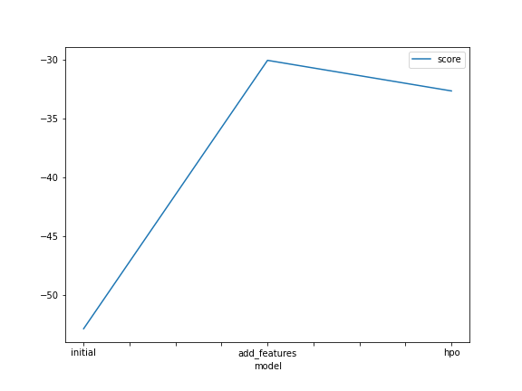
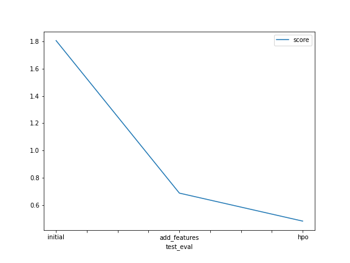

# Report: Predict Bike Sharing Demand with AutoGluon Solution
#### Andres Masis

## Initial Training
### What did you realize when you tried to submit your predictions? What changes were needed to the output of the predictor to submit your results?

The train and test sets needed to have the same column to perform a correct prediction of the model. So in this case for the train dataset it was needed to drop the unnecesary columns, and also replace values lower than zero by zero.

### What was the top ranked model that performed?

The top ranked model that performed was WeightedEnsemble.

## Exploratory data analysis and feature creation
### What did the exploratory analysis find and how did you add additional features?

As additional features I separate the datetime into year, month, day and hour, as well as the categorization for the seasons and weather to make more granular the values on the count column.

### How much better did your model preform after adding additional features and why do you think that is?

The model increment a 43% of performance, it is because the target colun count will be more define in tracks of time. 

## Hyper parameter tuning
### How much better did your model preform after trying different hyper parameters?

With the addition of the different hyperparameters the performance decrease an 8%.

### If you were given more time with this dataset, where do you think you would spend more time?

I would be using this time to perform more efforts in tunning the hyperparameters to find the best set to get the best results.

### Create a table with the models you ran, the hyperparameters modified, and the kaggle score.

|    model   |hpo1|hpo2|hpo3| score |
|------------|----|----|----|-------|
|   initial  |auto|auto|0.48|1.80753|
|add_features|  7 |  3 |0.54|0.68663|
|     hpo    |  7 |  17|0.48|0.40897|

### Create a line plot showing the top model score for the three (or more) training runs during the project.

### Create a line plot showing the top kaggle score for the three (or more) prediction submissions during the project.

## Summary
Having the right parameters when using hyperparameters affects in a positive way the outcome of the predictions gotten from the different models.
